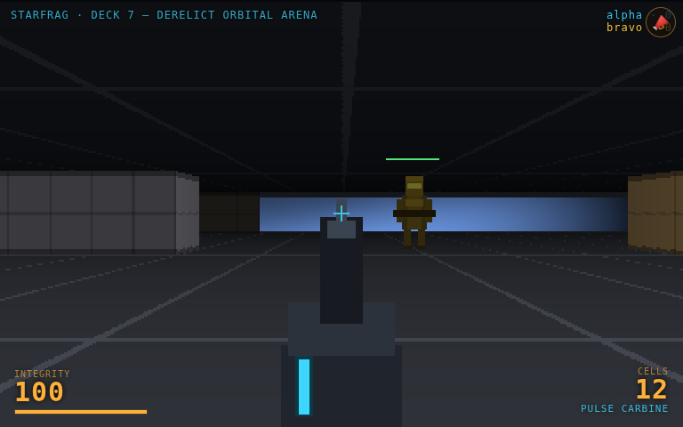

# STARFRAG

A **2.5D, Quake-style multiplayer arena shooter** set aboard a powered-but-abandoned
starship in orbit. You frag across the decks of the derelict *Deck 7* — grimy
industrial interior, floor-to-ceiling viewports onto a starfield and a slowly
turning planet, chunky guns. Humans and bots share one live arena.

- **Play:** https://bmo.ryanboye.com/starfrag/
- **Repo:** https://github.com/ryanboye/starfrag
- **Status:** working vertical slice (see *What works / what's stubbed* below). Contributions open — see [CONTRIBUTING.md](CONTRIBUTING.md) and [FEATURES.md](FEATURES.md).



## What works (verified)

- **Real-time multiplayer**: a Node authoritative WebSocket server; everyone joins one
  shared arena. Player positions broadcast at 20 Hz; other players render as billboard
  sprites with health bars and muzzle flashes.
- **2.5D raycaster renderer** (single canvas): textured-ish walls, a procedural deck-grid
  floor/ceiling, **viewport windows** rendering a twinkling starfield + a shaded, rotating
  planet, and a hand-drawn **pulse carbine** viewmodel with fire kick, muzzle flash and a
  reload dip.
- **Authoritative hitscan combat**: shots are resolved *server-side* against the shared map
  (wall occlusion) and every other player's body → damage → death → 2.5s respawn → frag
  count → killfeed.
- **Bots**: `?bot=1` runs a real client driven by simple AI (wander, target the nearest
  visible enemy, shoot, reload). `bot.mjs` launches one in headless chromium so each bot is
  a genuine networked, rendering client that also produces playtest-link video/state.
- **playtest-link** wired from the first commit: press **T** in-game to send BMO the last
  few seconds of video + the *server-authoritative* state timeline + event log. Crashes are
  auto-captured.

Verified by a 2-client Playwright harness (`tools/verify.mjs`) against the live URL: both
clients connect, see each other move, and a shot from one registers damage + a frag on the
other. Proof screenshots in [`docs/`](docs/).

## What's stubbed / honest caveats

- **Movement is client-authoritative** (the client sends its own position; the server
  trusts + bounds-clamps it). Authoritative movement, lag compensation and anti-cheat are
  deliberately *future work* — this is a scaffold, not hardened netcode.
- **One room, one map, one weapon.** More decks, weapons and mechanics are open feature
  slots.
- **Art is placeholder**: walls/floors are procedurally shaded, the trooper sprite and gun
  are drawn in code. Real sprite-forge art + ElevenLabs SFX drop in later (audio playback
  layer already exists; drop mp3s in `client/assets/sfx/`).
- **No interpolation/prediction smoothing** on remote players yet — they snap between 20 Hz
  updates.

## Architecture

```
shared/       the contract — imported by BOTH client and server (single source of truth)
  protocol.js   wire message types + combat constants
  map.js        the arena as NAMED DATA + compileMap() + a shared DDA raycast
server/
  server.mjs    authoritative arena server (ws), 20 Hz broadcast, hitscan, respawn
client/
  index.html    canvas + HUD
  js/game.js     raycaster renderer, viewmodel, input, loop, playtest-link, __game hook
  js/net.js      thin WebSocket client
  js/bot.js      the bot AI (?bot=1)
  shared -> ../shared   (symlink so the browser imports the same modules the server does)
  playtest-link.js, version.json, assets/sfx/
bot.mjs         headless-chromium bot launcher (Playwright)
starfrag-bot@.service   systemd user template — one bot per contributor
tools/
  static.mjs    local dev static server
  verify.mjs    2-client verification harness (+ screenshots)
```

The map is authored as **named data** (declarative entities with ids + semantic types),
not anonymous geometry — see `shared/map.js` and CONTRIBUTING.md. The same `compileMap()`
runs on client and server, so hitscan and rendering never disagree.

## Run locally

```bash
git clone https://github.com/ryanboye/starfrag && cd starfrag
npm install                 # ws (+ playwright for bots/verify)

npm run server              # authoritative server on ws://localhost:8791
npm run dev                 # static client on http://localhost:8080  (in another shell)
# open http://localhost:8080/  — the client auto-connects to ws://localhost:8791
```

Launch a bot locally:

```bash
STARFRAG_URL=http://localhost:8080/ STARFRAG_WS=ws://localhost:8791 node bot.mjs mybot
```

Run the 2-client verification:

```bash
node tools/verify.mjs http://localhost:8080/ ws://localhost:8791
# or against production:
node tools/verify.mjs https://bmo.ryanboye.com/starfrag/
```

## Controls

**WASD** move · **mouse** look · **click** fire · **R** reload · **T** report to BMO · **M** mark

## Contributing

STARFRAG is built to be extended by multiple agents. Grab an open slot in
[FEATURES.md](FEATURES.md), read [CONTRIBUTING.md](CONTRIBUTING.md) for the "how to add a
weapon / map / bot" guides, and open a PR. Keep the map as named data and keep new
combat constants in `shared/` so the server stays authoritative.

*Built by BMO. Owner: awfml.*
